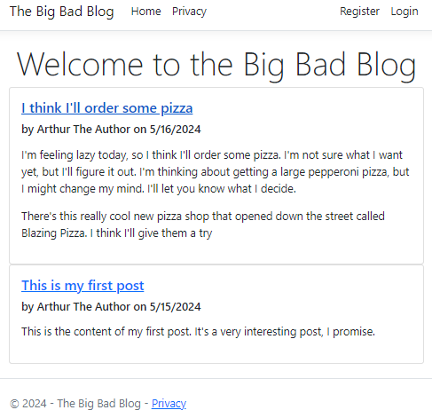

# BigBadBlog
The Big Bad Blog is a tutorial that demonstrates how to take a simple blog website with articles in markdown on disk, and make it into a large CMS

| Module |
| --- |
| [1 - Introducing the Blog and Aspire](docs/1-Introduction.md) |
| [2 - Working with Databases and Entity Framework](docs/2-Database.md) |