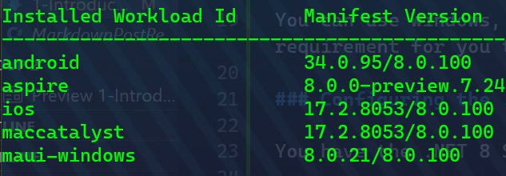
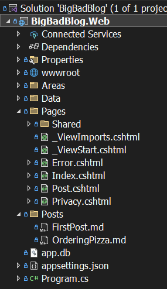
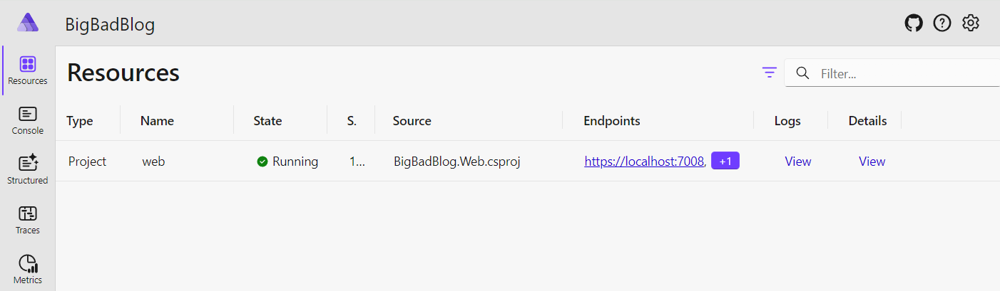
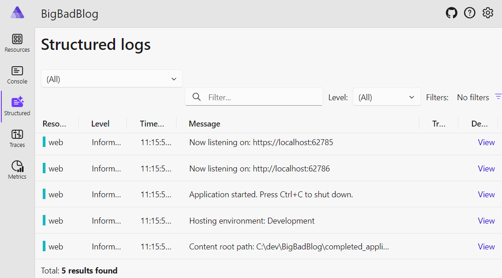
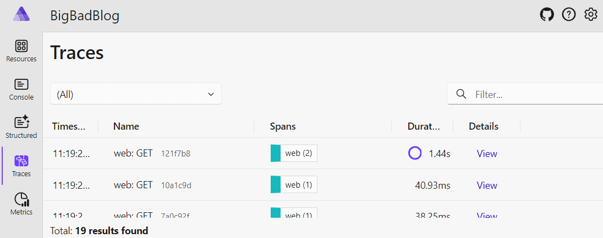
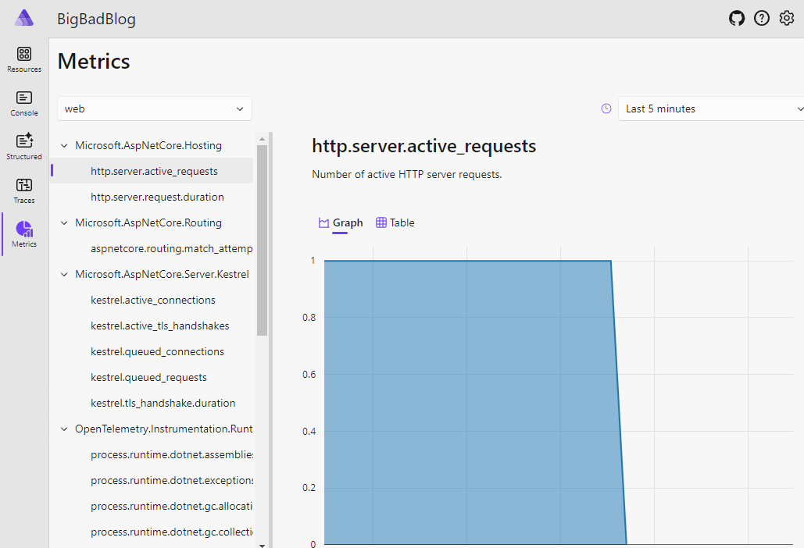
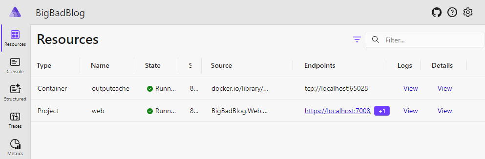
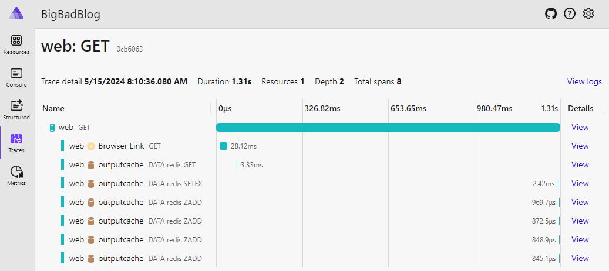

# 1 - Introducing the Big Bad Blog and Aspire

_The source code for this module starts with the folder [0-Start](../0-Start/) and the competed state at the end of this module is available in the folder [1-Introducing Aspire](../1-IntroducingAspire)_

.NET Aspire is not a .NET application framework in the traditional sense like WPF, Blazor, or .NET MAUI.  .NET Aspire is a tech-stack that enables development of distributed applications with support for the four-pillars of cloud native development: deployment, monitoring, tracing, and service discovery.  .NET Aspire makes your development experience better, and hands off a deployment configuration that can be used by other tools to deploy to Azure, Kubernetes, or AWS (as of May 2024)

In this module, we'll introduce the **Big Bad Blog** sample project and begin working through a series of upgrades to it using .NET Aspire.  Through this process you will learn about different architectures, development techniques, and the features of .NET Aspire.

## Prequisites

To run this workshop, we assume that you have the following features available on your workstation:

- [Docker](https://docker.com) or [Podman](https://podman.io/docs/installation)
- [.NET 8 SDK or later](https://get.dot.net) - you do not need a preview version
- .NET Aspire Workload

You may have Visual Studio 2022 or Visual Studio Code (with or without C# Dev Kit) installed on your workstation.  If you have Visual Studio 2022, you will need to be using v17.10 Preview or newer version.  The Visual Studio tools can help make this workshop easier, but are not required.

You can use Windows, Mac, or Linux to work on this workshop.  There is no specific operating system requirement for you to use.

### Configuring the .NET Aspire Workload

You have the .NET 8 SDK and can run the following command in a terminal window:

```
dotnet --version
```

and you should see a version `8.0.100` or later reported.

Next, let's check that you have the Aspire workload installed.  .NET workloads are a secondary install of features in the .NET SDK to help keep the download size small and allow extra features to be added as needed and maintained separately.

```
dotnet workload list
```

This command will report the collection of workloads that you have installed.  On my workstation in May 2024, it reports the following content:



The important part is that second line, Aspire is version 8.0.0-preview.7 or later.  If you do NOT have it listed, here is how to install the .NET Aspire workload:

1. Upload the list of workloads available to be installed with this command:

```
dotnet workload update
```

2. Download and install the aspire workload from the .NET team's servers using the command:

```
dotnet workload install aspire
```

3. Verify that .NET Aspire is available by reviewing the workload list:

```
dotnet workload list
```

#### Configuring Podman

By default, the .NET Aspire tools will look for and work with Docker.  If you'd like to use Podman instead, you can set an environment variable to instruct the tools to use Podman.  You can execute 1 command in the terminal to configure Podman for your system.

On Unix-based systems like Linux and MacOS:

```
export DOTNET_ASPIRE_CONTAINER_RUNTIME=podman
```

On Windows with Powershell:

```
$env:DOTNET_ASPIRE_CONTAINER_RUNTIME = "podman"
```

## The Big Bad Blog

Let's take a look at the [initial state of the Big Bad Blog](../0-Start/), an ASP.NET Core Razor Pages application that was built using the [Markdig NuGet package](https://www.nuget.org/packages/Markdig) to transform markdown content into HTML.

Go head and run the website project and take a look around the few pages that are running in the website.  Don't worry about the registration and login bits, we'll save those for another module.  IN Visual Studio or Visual Studio Code run can execute 'Debug Project' to get started.  At the command-line in the `BigBadBlog.Web` folder you can run:

```
dotnet run
```

This should open a browser with the home page for you to start exploring.

It's currently just 1 project, with a `Posts` folder that contains the markdown for the posts in our project:



Each of the [markdown posts](../0-Start/BigBadBlog.Web/Posts/FirstPost.md) has a bit of YAML frontmatter, some metadata about the post, at the top of the file that the website reads to help with delivering content:

```
---
Title: This is my first post
Date: 2024-05-15
Author: Arthur The Author
---

This is the content of my first post. It's a very interesting post, I promise.
```

### The Repository Pattern - Phase 1

This application has an `IPostRepository` interface that defines how it reads from the posts on disk:

```csharp
public interface IPostRepository
{

	Task<IEnumerable<(PostMetadata,string)>> GetPostsAsync(int count, int page);

	Task<(PostMetadata,string)> GetPostAsync(string slug);

}

public record PostMetadata(string Filename, string Title, string Author, DateTime Date)
{

	public string Slug => Uri.EscapeDataString(Title.ToLower());

}
```

The methods defined in this interface allow the markdown content of the post to be delivered as a second argument in the return values.  There is an implementation of the `IPostRepository` made available called `MarkdownPostRepository` that knows how to read the files from disk and return them when requested.

### Deployment

The configuration and deployment model of the Big Bad Blog in this current state dictates that a blog author writing a new article should commit a new markdown file in the `Posts` folder to GitHub.  At that point a GitHub action could deploy an update of the website to Azure with the content, restarting the hosted service.  While it may be a little clumsy, for our growing blogger this is a nice start.

... but we want MORE POWER!

## Introducing Aspire to the Big Bad Blog

Knowing that we want to grow the Big Bad Blog, let's start introducing .NET Aspire to the ASP.NET Core project and explore what it gives us with _JUST_ a single web application.  This process we'll go through is very similar to what you will do when adding .NET Aspire to existing application.

### 1. Add the AppHost project

.NET Aspire helps developers build their applications with sensible defaults and connecting to system services easier with a single point of entry to build and debug the application system.  This makes your development process MUCH easier by removing the requirement to start and manage the connectivity between containers, databases, and running components of your application.

This entry point for a .NET Aspire system is the **AppHost** project.  This is a project that you add to your solution and reference the other projects that need to be launched and coordinated to start the system.  We're starting slowly here, with just 1 project...  but we're going to get ambitious and add MORE.

You can create and add the AppHost project at the command-line with this command from within the root of the `BigBadBlog` folder right next to the `BigBadBlog.sln` file:

```
dotnet new aspire-apphost -o BigBadBlog.AppHost
```

You can then add the AppHost project to the solution file with this command:

```
dotnet sln add BigBadBlog.AppHost
```

If you are using Visual Studio 2022, simply add a new project to the solution of type **.NET Aspire App Host** and name it `BigBadBlog.AppHost`

This project has 1 file to start, a `Program.cs` file with the following content:

```csharp
var builder = DistributedApplication.CreateBuilder(args);

// we'll configure the application system HERE

builder.Build().Run();
```

This file is going to be the central-hub for how we configure our application system.  At this point, its declaring the existence of the DistributedApplication system and then running it.

Unlike other architectures and orchestrators where you might use JSON or YAML to configure the collection of services, we'll use C# and the vast array of .NET tools available to us.

### 2. Add a reference to the web project

Let's start to check out the magic of .NET Aspire.  We'll next create a reference in the `BigBadBlog.AppHost` project to the `BigBadBlog.Web` project.  You can run this command in a terminal from the `BigBadBlog.AppHost` folder:

```
dotnet add reference ../BigBadBlog.Web
```

In Visual Studio, you can right-click the project in Solution Explorer and **Add Reference** to the BigBadBlog.Web project.  

The result of either action should be visible in the `BigBagBlog.AppHost.csproj` file, where you will find an entry near the bottom of the file similar to:

```xml
<ItemGroup>
	<ProjectReference Include="..\BigBadBlog.Web\BigBadBlog.Web.csproj" />
</ItemGroup>
```

With that in place, let's build the AppHost project. You can use the **Build** command in Visual Studio or Visual Studio Code to build the entire solution, or just the `BigBadBlog.AppHost` project.  At the command-line in the `BigBadBlog.AppHost` folder you can run:

```
dotnet build
```

Everything should build properly... and now the fun happens.  Let's add the BigBadBlog website to the AppHost.  Insert the following statements into the `BigBadBlog.AppHost/Program.cs` file:

```csharp
var builder = DistributedApplication.CreateBuilder(args);

// NEW LINE:
var webApp = builder.AddProject<BigBadBlog_Web>("web");

builder.Build().Run();
```

That's all you need to get started.  We're adding a reference to another project in the solution with the `AddProject` method, using a very creatively delivered generic argument that points to our `BigBadBlog.Web` project and naming the created resource `web`.  We're also returning this resource as a variable named `webApp`.  Let's remember these for later.  

### 3. Running your first .NET Aspire Application

Now we can launch our website as part of a .NET Aspire system by running the `BigBadBlog.AppHost` project.  In Visual Studio or Visual Studio Code, change your startup project to the AppHost project and start the debugger.  You can start the AppHost at the command-line with `dotnet run` in the `BigBadBlog.AppHost` folder.

Your browser will open and you should then see... well.. not the blog, but something new.



This is the .NET Aspire dashboard.  It's configured to allow you to see all of the resources in your system, the logs and traces created in the system, and explore how all of the components are interconnected.  Let's kick things off and find the **Big Bad Blog** by clicking through to our web application by clicking the link in the **Endpoints** column for the `web` project.  Hey!  That's what we named the `BigBadBlog.Web` project resource we added to `Program.cs` above.  COOL!   

The blog should appear in a new tab in your browser and look the same as before.  Good job!  You've just configured your first .NET Aspire application!  It's not too impressive yet... but we're gonna step up on that quickly.

Before we go, click in to the **Logs** and **Details** links on the dashboard for the **web** project and explore.

## Adding Resiliency, Tracing with Open Telemetry, and Health Checks to the Big Bad Blog

Next, we're going to add resiliency, telemetry collection, logging, and health checks to the web application.  There is a standard base of services that we will add that are conveniently called the 'ServiceDefaults'.  

Let's add this as a new project to the solution.  In Visual Studio, add a new project of type **.NET Aspire Service Defaults** and call it `BigBadBlog.ServiceDefaults`.  At the command-line, in the root project folder next to the `BigBadBlog.sln` file, we can create this project with the commands:

```
dotnet new aspire-servicedefaults -o BigBadBlog.ServiceDefaults
dotnet sln add BigBadBlog.ServiceDefaults
```

If you explore the `ServiceDefaults/Program.cs` file you will see a lot of code that sets up HTTP resiliency for HttpClient objects, Open Telemetry logging and statistics collection, and more.  We won't tinker further with this configuration today.

Next, add a reference in the `BigBadBlog.Web` project to the new `BigBadBlog.ServiceDefaults` project using either the Visual Studio **Add Reference** dialog or the following command at the command-line in the `BigBadBlog.Web` folder:

```
dotnet add reference ../BigBadBlog.ServiceDefaults
```

Nice... you're almost there.  We just need to tell the web project to use the new service defaults that were provided.  Inside the `BigBadBlog.Web/Program.cs` file, right near the top, add the following line:

```csharp
var builder = WebApplication.CreateBuilder(args);

// Add Aspire service defaults
builder.AddServiceDefaults();
```

That's it!  Restart the AppHost project and let's take another look at the dashboard.  Start with the **Structured**  menu on the left.



We can see the logs from the console of the website, broken out in a more structured display with the ability to search through them and filter for specific logging levels.  

Go back to the **Resources** tab and open the website.  Navigate around a bit and return to the dashboard and check the **Traces** tab on the left side.



You should see some trace information like the above.  This shows you all requests that happened on the website and how they were processed.  As more systems and features come online, this will light up with more information.

Finally, let's check the **Metrics** tab.  This will show you how the system is performing.  Select the **web** resource from the combobox in the top left.  Then, select the `http.server.active_requests` metric in the panel on the left.  You should see a gauge that is slowly updating on the right:



All of this was enabled _JUST_ by adding the service defaults!

## Add another service - Redis!

The site right now loads data from disk, and with only 2 blog posts, that's going to run fast.  In the future at some point, it could take a lot of time to load and inspect all of those files.  Let's simulate this by adding a delay to the home page.

### Simulating a delay on the home page

In `BigBadBlog.Web/Pages/Index.cshtml.cs` update the `OnGetAsync` method to have a slight delay in it to help simulate having a LOT of data to read from disk:

```csharp
public async Task<IActionResult> OnGetAsync()
{

	// NEW LINE
	await Task.Delay(TimeSpan.FromSeconds(1));

	Posts = await _postRepository.GetPostsAsync(10, 1);

	return Page();

}
```

### Adding OutputCache to the website

This is certainly going to slow down the responsiveness to our website.  To compensate, we can add OutputCaching to the web application.  This is just a few lines of code in the `Program.cs` file of the `BigBadBlog.Web` project:

```csharp
// NEW LINE
builder.Services.AddOutputCache(options =>
{
	options.AddBasePolicy(policy => policy.Tag("ALL").Expire(TimeSpan.FromMinutes(5)));
	options.AddPolicy("Home", policy => policy.Tag("Home").Expire(TimeSpan.FromSeconds(30)));
	options.AddPolicy("Post", policy => policy.Tag("Post").SetVaryByRouteValue("slug").Expire(TimeSpan.FromSeconds(30)));
});

// Add my repository for posts
builder.Services.AddTransient<IPostRepository, MarkdownPostRepository>();

...

app.UseAuthorization();

// NEW LINE
app.UseOutputCache();

app.MapRazorPages();
```

I added some policies for the OutputCache so that the home page would expire in 30 seconds an the individual blog post pages would vary by the slug passed as a route parameter.

Finally, we'll add some OutputCache attributes to the `Index.cshtml.cs` and `Post.cshtml.cs` files so that they take advantage of the OutputCache:

```csharp
[OutputCache(PolicyName = "Home")]
public class IndexModel : PageModel
```

```csharp
[OutputCache(PolicyName = "Post")]
public class PostModel : PageModel
```

This should run normally, slow on the first request to the home page, but much faster after that.

Not bad... but that OutputCache is maintained in memory of the web service.  If the web service restarts or starts getting a lot of traffic, that in-memory cache could be pressured. It would be better to host that cache somewhere else... like Redis.

### Adding Redis

Redis is a robust open-source, in-memory database that you can use to store data and items like your ASP.NET Core OutputCache.  

We'll start by adding the `Aspire.Hosting.Redis` package to the `BigBadBlog.AppHost` project using either the NuGet package manager UI or the following command at the command-line:

```
dotnet add package Aspire.Hosting.Redis --prerelease
```

The `--prerelease` argument is required if you are running this before the RTM of .NET Aspire in late May 2024.

Next, we can define our Redis database in the `BigBadBlog.AppHost/Program.cs` file with a single command near the top of the file:

```csharp
var builder = DistributedApplication.CreateBuilder(args);

// NEW LINE
var cache = builder.AddRedis("outputcache");
```

This instructs .NET Aspire to create a Redis database in a container and add it to the running services.  We can communicate to our web project that this Redis service is available using a `WithReference` method on the `web` resource:

```csharp
var webApp = builder.AddProject<BigBadBlog_Web>("web")
	.WithReference(cache);
```

That was REALLY easy to connect the cache to the web.  Let's add a package to the `BigBadBlog.Web` project so that it can work with the Redis service and ship the OutputCache there:

```
dotnet add package Aspire.StackExchange.Redis.OutputCaching --prerelease
```

Finally, in the `BigBadBlog.Web/Program.cs` file, just above the declaration of the OutputCache and its policies, we'll instruct the website to use the Redis cache:

```csharp
// Add OutputCache service	
builder.AddRedisOutputCache("outputcache");
builder.Services.AddOutputCache(options => ...
```

Oooh.. look at that!  We're not using a full connection string with a host name, port, username and password.  We're _JUST_ passing the `outputcache` name that we declared in the `AddRedis` command in the AppHost project's `Program.cs` file.  This is our first glimpse of the **service discovery** feature of .NET Aspire.  We can pass references to services and components of our solution just by using the names we assign in the AppHost `Program.cs` file.

Go ahead and run the AppHost application again and check out the dashboard.  It will show the Redis is now running in the system:



Look at the **Details** panel for the **web** project in the dashboard and you should see a new environment variable passed called `ConnectionStrings__outputcache`.  This is .NET Aspire connecting your ASP.NET Core application to the Redis service.

Try navigating to the web project and exploring it now.  After the first render of the home page, the Redis hosted OutputCache should take over and return the remaining requests quickly.

Is it actually getting data from Redis?  Let's go back to the Dashboard and visit the **Traces** tab.  Look for an entry that lasts more than 1 second and click into that.  You should see something like this:



Now we can see the request to the website and that it attempted to get data from the **outputcache** service using a **GET** command, waited a second for processing to complete on the website, then set a value in the **outputcache** with a **SETEX** command.

### Peeking inside Redis

We've connected Redis to the application, but what's happening inside the database?  We could look at the logs on the Redis database from the dashboard, but what are the keys inside there?  We could start a tool ike RedisInsight to connect and explore the Redis database, but that's a little inconvenient.

Fortunately, there's a tool called RedisCommander available that we can add to our AppHost project that will allow us to interact with the Redis database from our browser.

Go back to the AppHost `Program.cs` file and we can add Redis Commander by extending the declaration of the `cache` variable using the method `WithRedisCommander`

```csharp
var cache = builder.AddRedis("outputcache")
	.WithRedisCommander();
```

Start the AppHost proejct again and you should now see the RedisCommander added to the list of resources on the dashboard.  Click the link to visit that service, and execute a `SCAN 0` command on the console at the bottom.  This will show you the collection of keys currently in the Redis database.

## Summary

We have come a LONG way in using .NET Aspire, and we're JUST getting started!  In this module we introduce the blog project and saw that its just a simple pair of pages that show the contents of some markdown files.  We learned about the console and traces in the .NET Aspire dashboard and added our first three services to the .NET Aspire system: our web project, a Redis cache, and Redis Commander.  We saw how .NET Aspire connects these services and provides a service discovery mechanism by generating environment variables like `ConnectionStrings__outputcache` that allow our projects to locate and connect to services in the system.

---

[Next Module: Database and Entity Framework](2-Database.md)