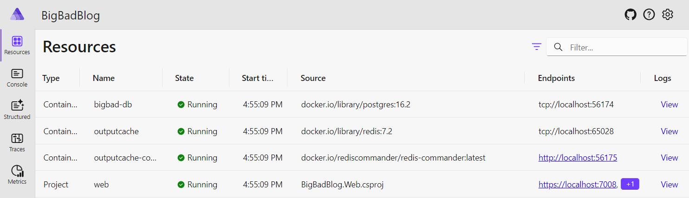
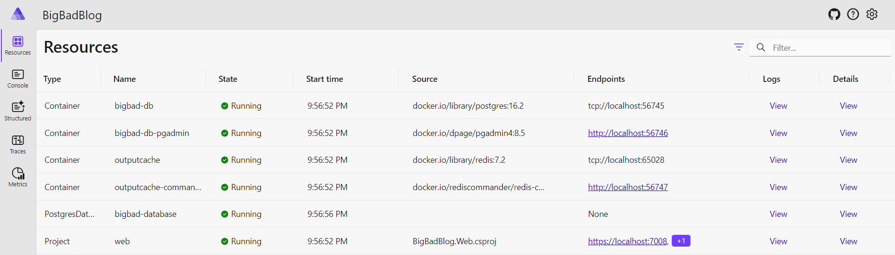

# 2 - Working with Databases and Entity Framework

Our little blog works nice with its markdown files, but we want to enable more users to work with the blog posts and that shared level of access means we should introduce a database.  A database will allow multiple users to read and write data as well as provide faster access to the data than reading a markdown file from disk.

## Introducing database providers

.NET Aspire has a number of **components** available that allow you to connect bits of system architecture together.  These components can run in a standalone workstation for development and testing.  When you're ready you can deploy those components and have a great production experience.

Aspire components typically have 2 parts: 
 1. a hosting package that will run the component on your developer system
 2. a library package for consuming the hosted service with optional telemetry and healthcheck features available

Among the database components available at the time of writing are:

- Azure Storage
- Azure Cosmos DB
- MongoDB
- MySQL
- Oracle
- PostgreSQL
- Qdrant
- Redis
- SQL Server

Microsoft Learn has an exhausitve list of the [current Aspire components](https://learn.microsoft.com/en-us/dotnet/aspire/fundamentals/components-overview?tabs=dotnet-cli#available-components) available.

### Add PostgreSQL to the system

We can introduce a PostgreSQL database to our application system by adding a project reference and a few lines into the `BigBadBlog.AppHost/Program.cs` file.

Add the `Aspire.Hosting.PostgreSQL` package to the `BigBadBlog.AppHost` project.  You can run this command in the AppHost project folder:

```shell
dotnet add package Aspire.Hosting.PostgreSQL
```

In the `Program.cs` file of that project, let's introduce the database:

```csharp
var builder = DistributedApplication.CreateBuilder(args);

var db = builder.AddPostgres("bigbad-db");
...
```

Running the application now shows the **bigbad-db** database running as a PostgreSQL container:



That's nice, we have a PostgreSQL container with a server.  Servers need databases and I'd like to be able to administer that database so that I can peek in there to look at the data.

Finally, I need to pass that database into my web application so that we can connect to it with Entity Framework.

We can enhance our code in `AppHost/Program.cs` to describe our database like this:

```csharp
var db = builder.AddPostgres("bigbad-db")
	.WithDataVolume()
	.WithPgAdmin()
	.AddDatabase("bigbad-database");

var webApp = builder.AddProject<BigBadBlog_Web>("web")
	.WithReference(cache)
	.WithReference(db)
	.WithExternalHttpEndpoints();
```

Let's review the new lines added:

- `WithDataVolume()` configures a data volume on disk to persist content to
- `WithPgAdmin()` launches a second container running the pgAdmin application.  This allows us to connect to our database and run SQL statements among other database administrative tasks
- `AddDatabase("bigbad-database")` adds a database to the server named 'bigbad-database'
- `WithReference(db)` passes a connection string for the "bigbad-database" into the web application.  The database is passed, not the server, because the `AddDatabase()` method was last in the chain 

Let's run it and take a look at the dashboard now:



We have a _SLIGHT_ problem with this configuration: the database will start and assign a random password to the default postgres user on every restart of the Aspire stack.  This is counter to the purpose of our decision to create a data volume that will persist content between restarts.  We can force a password on the database by passing in a parameter from the configuration of our AppHost project.  

Let's add a parameter and the appropriate configuration to `appSettings.json` to configure our PostgreSQL database with a password.

In `AppHost/Program.cs` we'll define a parameter and pass that parameter as the password argument for our database declaration:

```csharp
var postgresPassword = builder.AddParameter("pgPassword", secret: true);

var db = builder.AddPostgres("bigbad-db", password: postgresPassword);
```

Next, we need to define the `pgPassword` configuration value for the AppHost project.  We can add a `Parameters` section to the `appSettings.json` file with a `pgPassword` key-value pair to be used for this parameter:

```json
{
  "Logging": {
    "LogLevel": {
      "Default": "Information",
      "Microsoft.AspNetCore": "Warning",
      "Aspire.Hosting.Dcp": "Warning"
    }
  },
	"Parameters":{
		"pgPassword": "MyP@55w0rd!"
	}
}
```

The actual value of the password doesn't matter, but I like to be all fancy and 31337 mixing numbers, letters and symbols.

Now when we start the database, it will always configure it with the password `MyP@55w0rd!`

## Aside: System Constants

There's a LOT of strings that we're passing around in our `AppHost/Program.cs` file and eventually into our application files that define the names of connection strings and other services.  These 'magic strings' are easy to mix up and confuse when building the application system.

Let's centralize these names in a `Common` project that can be referenced by both the `AppHost` and `Web` projects to ensure consistent references to the names of services.

I'll add a new **Class Library** project to the solution called `BigBadBlog.Common` and update the class file that came in the template with this:

```csharp
namespace BigBadBlog;

public static class ServiceNames
{

	/// <summary>
	/// Constants for referencing the database containing blog posts
	/// </summary>
	public static class DATABASE_POSTS {

		public const string SERVERNAME = "bigbad-db";
		public const string NAME = "bigbad-database";

	}

	public const string OUTPUTCACHE = "outputcache";

}
```

We can add a reference to this project in the `AppHost` project by copying this XML element into the `BigBadBlog.AppHost.csproj` file:

```xml
  <ItemGroup>
    <ProjectReference Include="..\BigBadBlog.Common\BigBadBlog.Common.csproj" IsAspireProjectResource="false" />
    <ProjectReference Include="..\BigBadBlog.Web\BigBadBlog.Web.csproj" />
  </ItemGroup>
```

Notice the additional attribute `IsAspireProjectResource`.  This changes the Common project from being a resource that Aspire may configure to a standard class library reference.  We can update the database configuration in `Program.cs` to take advantage of these resources now:

```csharp
var db = builder.AddPostgres(ServiceNames.DATABASE_POSTS.SERVERNAME, password: postgresPassword)
	.WithDataVolume()
	.WithPgAdmin()
	.AddDatabase(ServiceNames.DATABASE_POSTS.NAME);
```

This will make it easier when we connect the website to the database and configure Entity Framework.

## Add Entity Framework and the data project

The next steps are _typically_ to configure the Entity Framework database context and resources in the web project.  I want to take a step away from that, to isolate those resources in setting up for the next steps in this project.

Let's allocate another class library project in the solution for the interactions with our PostgreSQL database.

```
dotnet new classlib -o BigBadBlog.Data.Postgres
```

I'll move the web application's `Data\ApplicationDbContext.cs` to this project so that the security database interactions are isolated with the PostgreSQL database libraries we'll place in this project.

To support and configure the `IdentityDbContext` type that the `ApplicationDbContext` inherits from, we'll need to add two references to this project:

```
dotnet add reference Microsoft.AspNetCore.Identity.EntityFrameworkCore
dotnet add reference Microsoft.AspNetCore.Identity.UI
```

Let's centralize our abstractions for working with the database repository.  Move the `Data/IPostRepository.cs` and `Data/PostMetadata.cs` files into the `BigBadBlog.Common` project so that we can reference that interface and `PostMetadata` object from our `BigBadBlog.Data.Postgres` project and the `BigBadBlog.Web` projects.  We'll add a reference to the Common project with this command executed in both the `BigBadBlog.Data.Postgres` and `BigBadBlog.Web` folder:

```
dotnet add reference ../BigBadBlog.Common
```

### Working with Entity Framework  

Let's define a `PgPost` object that contains information similar to the `PostMetadata` record, but appropriate for storage in PostgreSQL.

```csharp
public class PgPost
{

	[Key]
	public int Id { get; set; }

	[Required, MaxLength(100)]
	public string Title { get; set; }

	[Required, MaxLength(100)]
	public string Author { get; set; }

	[Required]
	public DateTime Date { get; set; }

	[Required]
	public string Content { get; set; }

	[Required, MaxLength(150)]
	public string Slug { get; set; }

	// explicit conversion to PostMetadata
	public static explicit operator PostMetadata(PgPost post)
	{
		return new PostMetadata("", post.Title, post.Author, post.Date);
	}

	// explicit conversation from PostMetadata
	public static explicit operator PgPost((PostMetadata, string) post)
	{
		return new PgPost
		{
			Title = post.Item1.Title,
			Author = post.Item1.Author,
			Date = post.Item1.Date,
			Content = post.Item2,
			Slug = post.Item1.Slug
		};
	}

}
```

I've also included two operator methods to help convert to and from the `PostMetadata` type that our website uses.

We can now reference the `PgPost` inside our `ApplicationDbContext` Entity Framework context so that we can read and write `PgPost` data in the PostgreSQL database. 

```csharp
public class ApplicationDbContext : IdentityDbContext
{
	public ApplicationDbContext(DbContextOptions<ApplicationDbContext> options)
			: base(options) { }

	public DbSet<PgPost> Posts { get; set; }

	protected override void OnModelCreating(ModelBuilder builder)
	{

		// Add an index to the PgPost slug column
		builder.Entity<PgPost>()
			.HasIndex(p => p.Slug)
			.IsUnique();

		// Add an index to the PgPost date column
		builder.Entity<PgPost>()
			.HasIndex(p => p.Date);

		base.OnModelCreating(builder);
	}

}
```

Let's wrap the ApplicationDbContext with a PostgreSQL-specific repository called `PgPostRepository`, and I'll generate most of the code using GitHub copilot:

```csharp
namespace BigBadBlog.Data.Postgres;

internal class PgPostRepository : IPostRepository
{
	private readonly ApplicationDbContext _context;

	public PgPostRepository(ApplicationDbContext context)
	{
		_context = context;
	}

	public async Task<(PostMetadata, string)> GetPostAsync(string slug)
	{
		var post = await _context.Posts
			.Where(p => p.Slug == slug)
			.Select(p => (PostMetadata)p)
			.FirstOrDefaultAsync();

		if (post == default)
		{
			return default;
		}

		var content = await _context.Posts
			.Where(p => p.Slug == slug)
			.Select(p => p.Content)
			.FirstOrDefaultAsync();

		return (post, content);
	}

	public async Task<IEnumerable<(PostMetadata,string)>> GetPostsAsync(int count, int page)
	{
		// fetch the posts from the database and convert them to PostMetadata
		var posts = await _context.Posts
			.OrderByDescending(p => p.Date)
			.Skip(count * (page - 1))
			.Take(count)
			.ToListAsync();

		return posts.Select(p => ((PostMetadata)p, p.Content));

	}

	public async Task AddPostAsync(PostMetadata metadata, string content)
	{
		var post = (PgPost)(metadata, content);

		post.Date = new DateTime(DateTime.Now.Ticks, DateTimeKind.Utc);
		_context.Posts.Add(post);

		await _context.SaveChangesAsync();
	}

	public async Task UpdatePostAsync(PostMetadata metadata, string content)
	{
		var post = (PgPost)(metadata, content);

		_context.Posts.Update(post);

		await _context.SaveChangesAsync();
	}

	public async Task DeletePostAsync(string slug)
	{
		var post = await _context.Posts
			.Where(p => p.Slug == slug)
			.FirstOrDefaultAsync();

		if (post != default)
		{
			_context.Posts.Remove(post);
			await _context.SaveChangesAsync();
		}
	}
}
```

We'll next add the Npgsql driver for Aspire to this project as a NuGet package:

```
dotnet add package Aspire.Npgsql.EntityFrameworkCore.PostgreSQL
```

This package contains information to optimize the connection for resiliency and provide logging using OpenTelemetry.

We need to connect this context to our database provider and connection string.  We normally do this in `Program.cs` but let's keep this isolated from the `Web` project.

Instead, we'll add a class file to the `BigBadBlog.Data.Postgres` project called `Program_Extensions.cs` that will contain some extension methods for configuring the web application.

We'll add the following content to this new file in order to configure the database context and make it available for the ASP.NET Core Identity UI:

```csharp
public static class Program_Extensions
{

	public static IHostApplicationBuilder? AddPostgresDatabaseServices(this IHostApplicationBuilder? host)
	{

		// Reuse the constant for the database name we saved
		// in the common project earlier
		host.AddNpgsqlDbContext<ApplicationDbContext>(ServiceNames.DATABASE_POSTS.NAME);
			
		host.Services.AddScoped<IPostRepository, PgPostRepository>();

		return host;

	}

	public static IHostApplicationBuilder? AddIdentityServices(this IHostApplicationBuilder? builder)
	{


		builder.Services.AddDefaultIdentity<IdentityUser>(options => options.SignIn.RequireConfirmedAccount = true)
				.AddEntityFrameworkStores<ApplicationDbContext>();

		return builder;

	}

}
```

### Updating the web project

We can now go back to the Web project and add a reference to the Postgres project:

```
dotnet add reference ../BigBadBlog.Data.Postgres
```

We can then activate the PostgreSQL features with these updates in our `Program.cs` file:

```csharp
...
// Add Aspire service defaults
builder.AddServiceDefaults();

builder.AddPostgresDatabaseServices();

// Add services to the container.
builder.AddIdentityServices();
...
```

At this point, our entire solution should build... but we don't have any objects in our database yet.  For that, we need database migrations.

## Introducing Database Migration Service


## Migrating Data

---
[Previous Module - 1 Introduction](1-Introduction.md) - Next Module